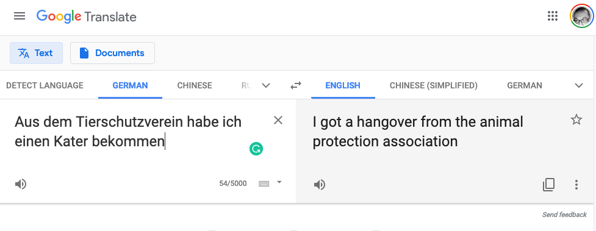
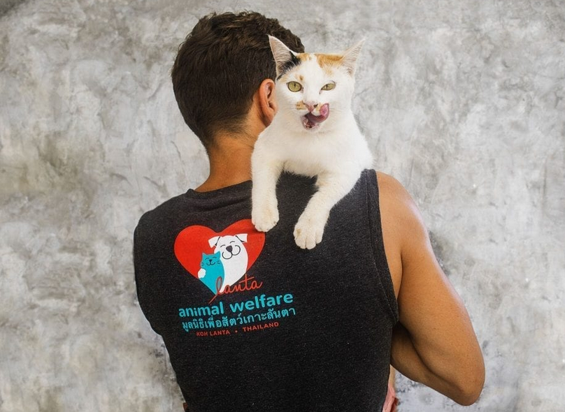
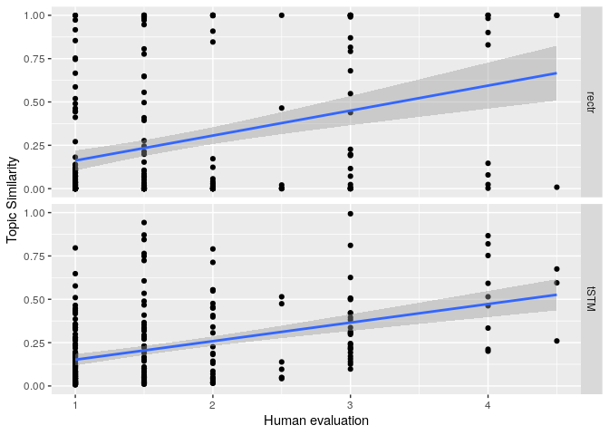
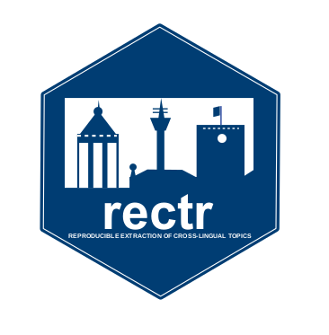

```{r xaringanExtra, echo = FALSE}
xaringanExtra::use_tile_view()
xaringanExtra::use_animate_all(params$animation)
xaringanExtra::use_logo(image_url = "img/mzes_logo.png", width = 280)
mzesalike::use_footer(params)
```

# Multilingual data: Topic model

* Welche Schäden Covid-19 im Körper anrichtet?
* 警與狗配圖教「狗」字 太陽島：是警犬 沿用11年
* Macron veut prolonger les droits des intermittents du spectacle jusqu'à août 2021
* Bevrijdende signaal in Europese voetbalcrisis komt uit Berlijn
* 現地調査は「正しい雰囲気で」　コロナ起源巡り中国大使
*  ‘사퇴 거부’ 양정숙ㆍ시민당 맞고소 진흙탕 싸움 
* الشفاء من فيروس كورونا: روايات مرضى لا يستطيعون التخلص من الفيروس
* דו"ח פנימי בסין: העוינות בין בייג'ין לוושינגטון עלולה להידרדר לעימות מזוין

---

# Path of least resistance



.small[.footnote[
[1] De Vries, E., Schoonvelde, M., & Schumacher, G. (2018). No longer lost in translation: Evidence that Google Translate works for comparative bag-of-words text applications. Political Analysis, 26(4), 417–430.

[2] Reber, U. (2019). Overcoming Language Barriers: Assessing the Potential of Machine Translation and Topic Modeling for the Comparative Analysis of Multilingual Text Corpora. Communication Methods and Measures, 13(2), 102–125.
]
]

---

# Context matters

--

.pull-left[

]

--

.pull-right[

]

---

# Reproducibility matters

.pull-left[

]

.pull-right[

]

.center[Do you remember them?]

???

killedbygoogle.com
---

# Our proposal

.pull-left[
1. Use of archivable aligned word embeddings (Facebook's FastText)

2. From "bag-of-embeddings" to document-embeddings

3. Adjust for systematic differences between langauges with SVD

4. Guassian Mixture Model
]

.pull-right[



]
---
class: center, hide-logo, hide-footer



In an easy-to-use `r fontawesome::fa("r-project")` package


---
background-image: url(https://media.giphy.com/media/vFKqnCdLPNOKc/source.gif)
background-position: center
background-size: cover
class: hide-logo, center,  hide-footer, bottom

.imagelab[Es gibt keinen Kater: A Practical Scenario]

---
class: inverse

    ## # A tibble: 3,391 x 10
    ##    path  id    pubdate headline lede  body  lang  content    nt tokenized_conte…
    ##    <chr> <chr> <chr>   <chr>    <chr> <chr> <chr> <chr>   <int> <list>          
    ##  1 ./pa… arti… 2 Nove… "Maladi… "Ave… "Dan… FR    "Avec …  1026 <chr [1,138]>   
    ##  2 ./pa… arti… 2 Nove… "« Cela… "LE … "Pat… FR    "LE FI…   734 <chr [820]>     
    ##  3 ./pa… arti… 2 Nove… "L'Iran… "L'a… "de … FR    "L'anc…   984 <chr [1,081]>   
    ##  4 ./pa… arti… 2 Nove… "Matthi… "Le … "Mat… FR    "Le pr…  1077 <chr [1,213]>   
    ##  5 ./pa… arti… 2 Nove… "Les 31… "Lan… "EUR… FR    "Lancé…  1012 <chr [1,115]>   
    ##  6 ./pa… arti… 2 Nove… "Genera… "Apr… "À l… FR    "Après…   800 <chr [874]>     
    ##  7 ./pa… arti… 2 Nove… "La dis… "Seu… "Les… FR    "Seul …  1171 <chr [1,318]>   
    ##  8 ./pa… arti… 2 Nove… "Les ca… "Ils… "Ce … FR    "Ils d…   552 <chr [612]>     
    ##  9 ./pa… arti… 2 Nove… "Le pré… "FRA… "À l… FR    "FRANÇ…   506 <chr [589]>     
    ## 10 ./pa… arti… 2 Nove… "La nui… "  Ç… "Au … FR    "  ÇA …   516 <chr [552]>     
    ## # … with 3,381 more rows

---

# Data

3139 articles with the keyword **Paris** from Nov 1 2015 to Dec 31 2015 from The New York Times (English), Süddeutsche Zeitung (German) and Le Figaro (French).

Data requirement: 

1. character vector of content, e.g. `paris$content`
2. character vector of language, e.g. `paris$lang`

```r
c("fr", "de", "en")
```
---

# Step 1: Download word embeddings

```{r, eval = FALSE}
get_ft("fr")
get_ft("de")
get_ft("en")
```

You can archive the word embeddings, hence it is reproducible.

---
background-image: url(ft_download.webp)
background-position: center
background-size: cover
class: hide-logo, center,  hide-footer, bottom

---
# Step 2: Read word embeddings

```r
emb <- read_ft(c("fr", "de", "en"))
```

---
# Step 2: Create a multilingual corpus

Create a quanteda compatible multilingual corpus

```r
paris_corpus <- create_corpus(paris$content, paris$lang)
```
---
class: hide-logo, hide-footer, center, inverse, middle

```{r, echo=FALSE}

```

---
# Step 3: Create document-feature matrix from word embeddings

```r
paris_dfm <- transform_dfm_boe(paris_corpus, emb)
```

---
class: hide-logo, hide-footer, center, inverse, middle

```{r, echo=FALSE}

```

---
# Step 4: Filter the DFM by k

k: number of topics

```r
paris_dfm_filtered <- filter_dfm(paris_dfm,
                                 paris_corpus, k = 5)
```

---
class: hide-logo, hide-footer, middle

```{r, echo=FALSE}
require(rectr)
```

```{r}
paris_dfm_filtered <- filter_dfm(paris_dfm,
                                 paris_corpus, k = 5)
paris_dfm_filtered
```

---
# Step 5: Fit a Guassian Mixture Model

```r
paris_gmm <- calculate_gmm(paris_dfm_filtered, seed = 42)
paris_gmm
dim(paris_gmm$theta)
```
---
class: hide-logo, hide-footer, middle

```{r}
paris_gmm <- calculate_gmm(paris_dfm_filtered, seed = 42)
paris_gmm
```

```{r}
dim(paris_gmm$theta)
```

---
# Articles with high $\theta_{t}$ 

```{r, echo = FALSE, message = FALSE}
require(tidyverse)
require(quanteda)

get_sample <- function(i, paris_corpus, theta, threshold = 0.8, replace = FALSE) {
    tibble(hl = docvars(paris_corpus, "headline"), lang = docvars(paris_corpus, "lang"), prob = theta[,i]) %>% group_by(lang) %>% filter(prob > threshold) %>% sample_n(size = 5, weight = prob, replace = replace) %>% select(hl, lang, prob) %>% ungroup %>% arrange(lang, prob) %>% mutate(topic = i)
}

set.seed(42)
map_dfr(1:5, get_sample, paris_corpus, theta = paris_gmm$theta) %>% unique %>% rename(headline = 'hl')  -> res
```
```{r, results = "asis", echo = FALSE}
DT::datatable(res, options = list(pageLength = 5)) %>% DT::formatRound("prob", 2) %>% DT::formatStyle(c(1,2,3,4), fontSize = '65%')
```

---

# Tracking cross-lingual news topic

```{r, echo = FALSE, message = FALSE, fig.width = 12}
require(lubridate)
tibble(theta = c(paris_gmm$theta[,1], paris_gmm$theta[,2], paris_gmm$theta[,3], paris_gmm$theta[,4], paris_gmm$theta[,5]), lang = rep(docvars(paris_corpus, "lang"), 5), pubdate = rep(docvars(paris_corpus, "pubdate"), 5), topic = c(sort(rep(1:5, length(paris_corpus))))) %>% mutate(pubdate = lubridate::dmy(pubdate)) %>% group_by(topic, lang, pubdate ) %>% summarise(mean_theta = mean(theta)) %>% ggplot(aes(x = pubdate, y = mean_theta, color = lang)) + geom_line() + facet_grid(topic ~ . ) -> topic_plot
plotly::ggplotly(topic_plot)
```
---
# The team

* Jing Zeng
* Hartmut Wessler
* Marc Jungblut
* Kasper Welbers
* Joseph Bajjalieh
* Wouter van Atteveldt
* Scott Althaus

Part of the [Responsible Terrorism Coverage](https://responsibleterrorismcoverage.org/) Project

`r fontawesome::fa("twitter")` : resteco

---
background-image: url(https://media.giphy.com/media/llKJGxQ1ESmac/source.gif)
background-position: center
background-size: cover
class: hide-logo, center,  hide-footer, middle

.imagelab[ICA Computational Methods Top Paper]

---
class: center, hide-logo

# Available now!


`r fontawesome::fa("github")` : [chainsawriot/rectr](https://github.com/chainsawriot/rectr)

Slides: [chainsawriot.github.io/ica2020_rectr](https://chainsawriot.github.io/ica2020_rectr)
